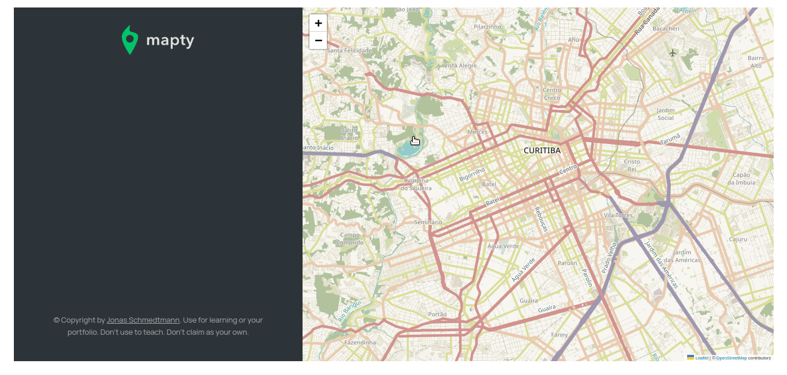

# Mapty 🗺️ 🗺️ 🗺️

> # Description / Descrição

Mapty is a vanilla JavaScript application that interacts with the Leaflet library and display Map. ts structure is built with OOP using classes and objects.

[🔗 Click here to access / Clique aqui para acessar](https://mapty-vitorfnery.netlify.app/)

## ✅ Features

- Displaying Map using Leaflet library

- Position automatically obtained by the browser using Geolocation API

- Create or remove workouts

- Show workouts on map

- Move to marker when workout is clicked

- Saving workouts to localstorage

## 🛠️ Technologies / Tecnologias

- JavaScript
- HTML
- CSS
- Git and Github

## 📣 Contact / Contato

vitorfelipenery@gmail.com
